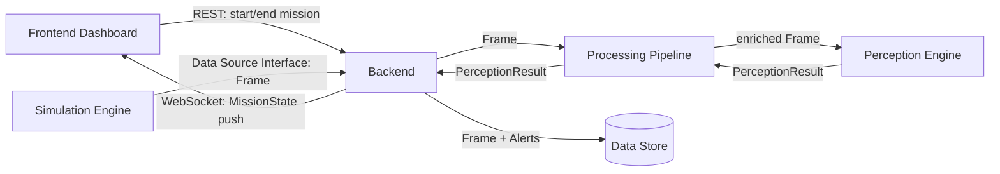
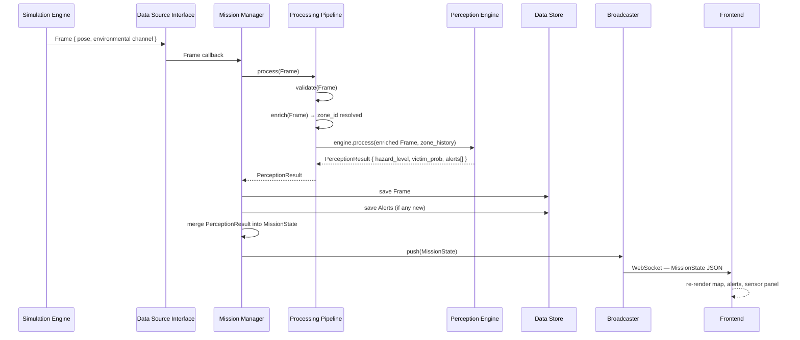

# API Design

Communication design for FireRescue AI — philosophy, module interactions, and message flow.

---

## Communication Philosophy

The backend is the single communication hub of the system. All data flows through it. No module communicates directly with any other module except through the backend.

This principle has four consequences:

**1. The frontend never talks to the simulation.** The frontend is a display layer. It receives `MissionState` from the backend only. If the data source changes from simulation to hardware, the frontend is unaffected.

**2. The frontend has no knowledge of perception outputs.** The dashboard receives only `MissionState`, which is assembled and owned by the Mission Manager. Raw Frames, PerceptionResults, and zone analysis details are internal to the backend. The display contract (`MissionState`) is stable even if the perception engine's internal schema changes.

**3. The Perception Engine is not a service.** In the MVP, the perception engine is a Python library called by the pipeline within the same process. There is no HTTP call, no message queue, no subprocess. If the engine ever needs to scale independently, it can be extracted — but only when that need is proven.

**4. The Data Source Interface is the only external contract the backend defines for inputs.** Anything that wants to provide data to the backend must produce `Frame` objects conforming to this interface. The backend asks no questions about the source.

---

## Module Interactions



---

## Frontend → Backend (REST)

The frontend makes infrequent REST calls for operator actions:
- Start a new mission
- End the current mission
- Fetch the current `MissionState` on page load (to recover from a browser refresh)

REST is appropriate here because these are request-response interactions, not streams.

---

## Backend → Frontend (WebSocket)

After every Frame is processed, the Mission Manager pushes the current `MissionState` to all connected clients. The frontend is entirely reactive — it renders whatever `MissionState` it receives and holds no local application state.

`MissionState` is the complete display contract:

```
MissionState:
    mission_id:       string
    status:           ACTIVE | ENDED
    elapsed_seconds:  float
    drone_pose:
        x:            int
        y:            int
        floor:        int
    zone_states:      dict[zone_id → ZoneState]
        zone_id:             string
        label:               string
        grid_x:              int
        grid_y:              int
        hazard_level:        CLEAR | LOW | MODERATE | HIGH | CRITICAL
        victim_probability:  float (0.0 – 1.0)
        last_observed_at:    datetime | null
    active_alerts:    list of Alert
        alert_id:     string
        zone_id:      string
        type:         HAZARD_ELEVATED | VICTIM_DETECTED
        severity:     WARNING | CRITICAL
        message:      string
        triggered_at: datetime
    latest_readings:
        temperature:   float | null
        co_level:      float | null
        smoke_density: float | null
```

A client that connects mid-mission receives the full current `MissionState` immediately on connection and is instantly up to date.

---

## Simulation → Backend (Data Source Interface)

The simulation adapter calls the ingestion callback with a `Frame` on each tick. The `Frame` is the only data unit that crosses the Data Source Interface.

```
Frame:
    frame_id:    string       (UUID)
    mission_id:  string
    timestamp:   datetime     (UTC)
    drone_id:    string
    pose:
        x:       int          (grid coordinate)
        y:       int
        floor:   int
        heading: float        (degrees; future use)
    channels:
        "environmental":
            temperature:   float   (Celsius)
            co_level:      float   (ppm)
            smoke_density: float   (0.0 – 1.0)
        "thermal":  ...      (future)
        "rgb":      ...      (future)
        "lidar":    ...      (future)
```

The `channels` dictionary is the extensibility point. A hardware adapter with a thermal camera populates `channels["thermal"]`. The MVP adapter populates only `channels["environmental"]`. The pipeline and perception engine inspect which channels are present and process only what they recognise.

---

## Backend → Perception Engine (In-Process Function Call)

The pipeline calls the perception engine as a pure function. The engine receives the enriched Frame and the Mission Manager's current zone history. It returns a `PerceptionResult`.

```
PerceptionResult:
    frame_id:           string
    zone_id:            string
    hazard_level:       CLEAR | LOW | MODERATE | HIGH | CRITICAL
    victim_probability: float (0.0 – 1.0)
    alerts:             list of Alert
```

`PerceptionResult` is an internal type. It is never sent to the frontend. The Mission Manager translates it into `MissionState` before broadcasting.

---

## Future API Strategy

### 1. Hardware Adapter Endpoint
When real hardware needs to POST Frames to the backend over HTTP rather than calling the ingestion layer in-process, a dedicated endpoint `/ingest/frame` is added. It validates the `Frame` payload and routes it through the same pipeline. No other code changes are required.

### 2. Perception Engine as a Service
If perception inference becomes expensive (e.g., a neural network model requiring GPU), the engine can be extracted to a separate process. The pipeline calls it via HTTP or a lightweight queue. The `PerceptionResult` schema is unchanged; only the transport changes.

### 3. Multi-Client WebSocket Subscriptions
Today the broadcaster pushes `MissionState` to all clients identically. If multiple operator roles are introduced (incident commander, team leader), the broadcaster can filter or scope which fields each client receives based on their subscription.

---

## Expected Message Flow

The following sequence covers one complete Frame cycle, from simulation tick to frontend render.



This sequence completes within one tick cycle. The target end-to-end latency from Frame delivery to frontend render is under 500 ms on a local machine.
