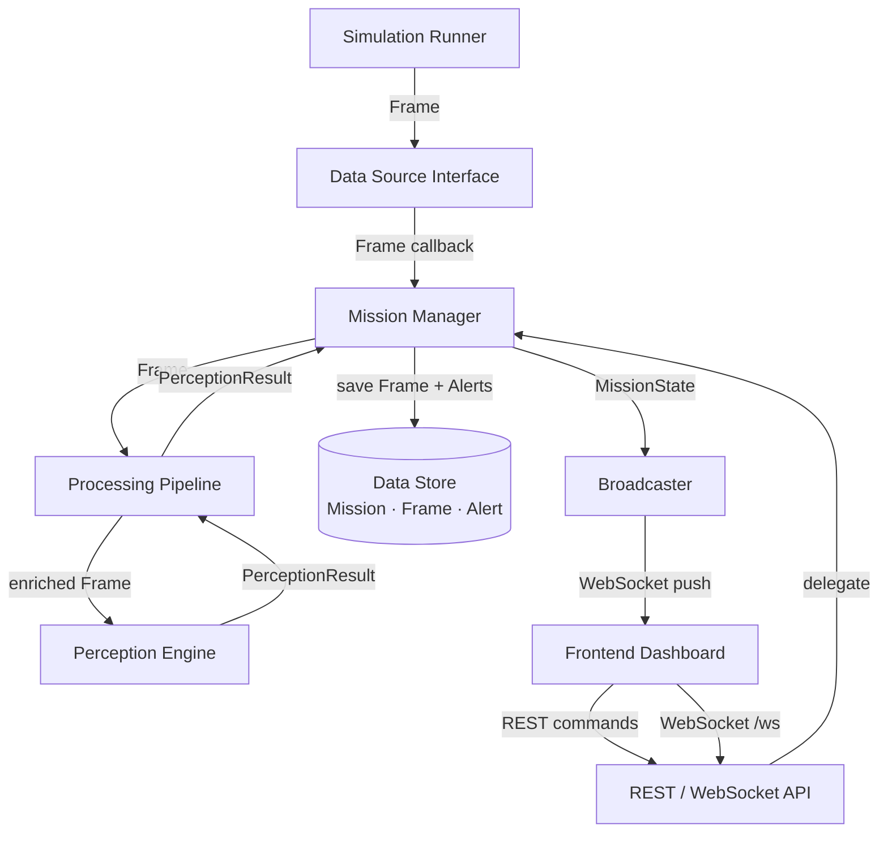

# Architecture

Software architecture design for the FireRescue AI MVP prototype.

---

## Guiding Principles

Every decision in this architecture follows the same set of constraints:

- **Single Responsibility.** Each module does one thing. If you cannot describe a module's purpose in one sentence, it is doing too much.
- **Replaceable components.** Every module communicates with its neighbors through a defined interface. The internal implementation can change without the neighbors knowing.
- **No premature abstraction.** The architecture only introduces layers and interfaces where they provide clear value. The MVP is a prototype, not a distributed system.
- **The simulation is temporary.** The architecture is designed so that simulation can be removed and replaced with hardware at any point without touching the pipeline, perception engine, or frontend.

---

## Module Hierarchy

```
FireRescue-AI/
├── simulation/
│   ├── environment.py     # Building floor plan: grid, zones, adjacency
│   ├── drone.py           # Virtual drone: position, path, movement
│   ├── sensors.py         # Sensor value generation per zone and scenario
│   ├── scenarios.py       # Preset hazard scenarios (fire origin, spread, victims)
│   └── runner.py          # Tick loop: drives simulation, publishes Frames
│
├── backend/
│   ├── main.py            # Application entry point; wires all components
│   ├── ingestion/
│   │   ├── interface.py   # DataSource protocol + Frame schema definition
│   │   └── sim_adapter.py # Wraps simulation runner to implement DataSource
│   ├── pipeline/
│   │   ├── pipeline.py    # Executes stages in sequence; returns PerceptionResult
│   │   ├── validator.py   # Stage 1: validates Frame fields and mission context
│   │   └── enricher.py    # Stage 2: resolves drone pose to a zone_id
│   ├── mission/
│   │   └── manager.py     # Mission lifecycle; owns MissionState; drives pipeline
│   ├── store/
│   │   ├── models.py      # ORM models: Mission, Frame, Alert
│   │   └── repository.py  # Read/write operations; abstracts database engine
│   ├── broadcaster.py     # Serializes MissionState and pushes to WebSocket clients
│   └── api/
│       ├── routes.py      # REST endpoints: /mission/start, /mission/end, /mission/state
│       └── websocket.py   # WebSocket endpoint: /ws
│
├── perception/
│   ├── hazard.py          # Hazard classifier: environmental channel → HazardLevel
│   ├── victim.py          # Victim estimator: zone history → victim probability
│   ├── alerts.py          # Alert generator: PerceptionResult → Alert[]
│   └── engine.py          # Orchestrator: Frame + context → PerceptionResult
│
├── frontend/
│   ├── src/
│   │   ├── components/
│   │   │   ├── FloorMap.tsx       # Building grid; colors zones by hazard level
│   │   │   ├── DroneMarker.tsx    # Drone position overlay
│   │   │   ├── SensorPanel.tsx    # Latest environmental readings
│   │   │   ├── AlertPanel.tsx     # Active alerts list
│   │   │   └── MissionBar.tsx     # Start/end controls; mission timer
│   │   ├── hooks/
│   │   │   └── useMissionSocket.ts  # WebSocket connection; exposes MissionState
│   │   ├── types/
│   │   │   └── mission.ts         # TypeScript types mirroring MissionState schema
│   │   └── App.tsx
│   └── public/
│
└── docs/
```

---

## Component Responsibilities

### Simulation Engine (`simulation/`)

The simulation engine is a self-contained module that generates synthetic mission data. It has no knowledge of the backend beyond the `Frame` schema it must produce.

| File | Responsibility |
|---|---|
| `environment.py` | Defines the building as a grid of zones. Knows which zones are rooms, corridors, and stairwells. Provides adjacency information for fire spread. |
| `drone.py` | Maintains drone position and moves it along a pre-defined waypoint path. One step per tick. |
| `sensors.py` | Given a zone and the current scenario state, returns an `environmental` channel payload. Values in safe zones are near baseline; values in hazard zones follow a scenario-defined profile. |
| `scenarios.py` | Defines initial conditions and evolution rules for hazard scenarios. Manages fire spread state between ticks. Places victims at startup. |
| `runner.py` | The tick loop. Advances the scenario state, moves the drone, assembles a `Frame`, and delivers it via the DataSource callback. |

---

### Data Source Interface (`backend/ingestion/interface.py`)

The hardware independence boundary. Any data source — simulation or hardware — implements this protocol. The rest of the system never sees through it.

```
DataSource (Protocol):
    start(mission_id: str) -> None
    stop()                 -> None
    on_frame: Callable[[Frame], Awaitable[None]]
```

The unit crossing this boundary is a `Frame` — a synchronized snapshot from the drone at a point in time. A `Frame` carries a `pose` (position and orientation) and a `channels` dictionary. For the MVP, one channel is populated: `environmental`. Future hardware adds further channels without changing the interface.

```
Frame:
    frame_id:   string       (UUID)
    mission_id: string
    timestamp:  datetime     (UTC)
    drone_id:   string
    pose:
        x:       int         (grid coordinate)
        y:       int
        floor:   int
        heading: float       (degrees; future use)
    channels:
        "environmental":
            temperature:   float   (Celsius)
            co_level:      float   (ppm)
            smoke_density: float   (0.0 – 1.0)
        "thermal":  ...      (future)
        "rgb":      ...      (future)
        "lidar":    ...      (future)
```

A hardware adapter that provides only environmental sensors populates only `channels["environmental"]`. A future adapter with a thermal camera adds `channels["thermal"]`. The pipeline and perception engine inspect which channels are present and act accordingly.

---

### Processing Pipeline (`backend/pipeline/`)

The pipeline is a sequential processing chain that sits between the Data Source Interface and the Perception Engine. It receives a raw `Frame` and returns a `PerceptionResult`. The Mission Manager delegates all per-frame work to the pipeline.

```
Frame
  │
  ▼ validator.py     — validates schema; rejects malformed or stale frames
  │
  ▼ enricher.py      — resolves pose (x, y, floor) to a zone_id
  │
  ▼ perception/engine.py  — classifies hazard, estimates victim probability
  │
  ▼ PerceptionResult
```

Each stage is a function that receives a frame (or enriched frame) and returns a result. Stages do not write to the database or network. If a stage rejects a frame, it returns an error result and the pipeline stops processing that frame. The Mission Manager logs the rejection and continues.

The pipeline is the extensibility point for future preprocessing: noise filtering, coordinate transformation, sensor fusion across multiple channels. Adding a new stage does not change the Mission Manager, the Perception Engine, or the Data Source Interface.

---

### Mission Manager (`backend/mission/manager.py`)

The Mission Manager is the central coordinator. It is the only component that references all other backend components.

**Responsibilities:**
- Creating a new mission record when a mission starts
- Activating the data source (`DataSource.start()`)
- Receiving each `Frame` from the data source callback
- Handing each `Frame` to the pipeline and receiving a `PerceptionResult`
- Persisting the raw `Frame` to the data store
- Persisting any new `Alert` objects returned by the pipeline
- Merging the `PerceptionResult` into the in-memory `MissionState`
- Handing the updated `MissionState` to the broadcaster
- Stopping the data source and marking the mission as ended on operator command
- Providing the current `MissionState` on demand for REST clients

The Mission Manager owns `MissionState`. No other component writes to it. The `MissionState` is always a complete, self-consistent snapshot of the current mission, ready to be sent to the frontend. The frontend never receives raw perception outputs.

```
MissionState:
    mission_id:      string
    status:          ACTIVE | ENDED
    elapsed_seconds: float
    drone_pose:      Pose
    zone_states:     dict[zone_id → ZoneState]
                         zone_id:            string
                         label:              string
                         grid_x:             int
                         grid_y:             int
                         hazard_level:       HazardLevel
                         victim_probability: float
                         last_observed_at:   datetime | null
    active_alerts:   list of Alert
    latest_readings:
                         temperature:   float | null
                         co_level:      float | null
                         smoke_density: float | null
```

---

### Perception Engine (`perception/`)

The perception engine is a pure computation layer. It receives a Frame (already enriched with a zone_id by the pipeline) and the Mission Manager's current zone history. It returns a `PerceptionResult`. It does not write to the database, does not communicate over the network, and holds no persistent state.

| File | Responsibility |
|---|---|
| `hazard.py` | Maps the `environmental` channel values to a `HazardLevel` enum using threshold rules. Designed to be replaceable with a trained classifier. |
| `victim.py` | Updates a victim presence probability estimate for the current zone using a Bayesian-style update driven by CO and temperature levels. |
| `alerts.py` | Checks the combined hazard level and victim probability against thresholds. Returns `Alert` objects when thresholds are crossed; checks for duplicates before generating. |
| `engine.py` | Calls hazard, victim, and alert logic in sequence. Entry point: `process(frame, zone_history) → PerceptionResult`. |

```
PerceptionResult:
    frame_id:           string
    zone_id:            string
    hazard_level:       CLEAR | LOW | MODERATE | HIGH | CRITICAL
    victim_probability: float (0.0 – 1.0)
    alerts:             list of Alert
```

The perception engine checks which channels are present in the Frame before processing. A Frame with no `environmental` channel produces a `PerceptionResult` with `hazard_level: CLEAR` and no alerts. Future perception modules (e.g., thermal object detection) handle their respective channels independently.

---

### Data Store (`backend/store/`)

Handles all persistence. The Mission Manager calls the repository; no other component touches the database directly.

**Persisted entities for MVP:** `Mission`, `Frame`, `Alert`.

The repository exposes three operations that matter during a live mission:
- `save_frame(frame)` — append a raw Frame
- `save_alerts(alerts)` — append new Alert records
- `get_recent_frames(mission_id, zone_id, n)` — return the last N frames for a zone (used by the perception engine for zone history)

Zone definitions (floor plan layout) are not stored in the database. They are loaded from a configuration file at startup and held in memory by the Mission Manager. They are static for a given scenario.

---

### Broadcaster (`backend/broadcaster.py`)

Maintains the set of active WebSocket connections. The Mission Manager calls `broadcaster.push(mission_state)` after every frame is processed. The broadcaster serializes `MissionState` to JSON and sends it to every connected client.

The broadcaster has no knowledge of mission logic. It cannot modify state. It is a one-way pipe from Mission Manager to frontend.

---

### REST + WebSocket API (`backend/api/`)

The external interface of the backend.

**REST endpoints:**

| Method | Path | Action |
|---|---|---|
| `POST` | `/mission/start` | Create and activate a new mission |
| `POST` | `/mission/end` | End the active mission |
| `GET` | `/mission/state` | Return the current `MissionState` |

**WebSocket endpoint:**

| Path | Behavior |
|---|---|
| `/ws` | Accept connection; register with broadcaster; immediately push current `MissionState` |

---

### Frontend Dashboard (`frontend/`)

The frontend is a single-page React application. It subscribes to the backend WebSocket and renders the received `MissionState`. It has no knowledge of Frames, PerceptionResults, or zone analysis logic. It only knows the `MissionState` schema.

The frontend is entirely reactive. Every render is driven by the latest `MissionState` from the WebSocket. It holds no derived state and performs no computation on the data it receives.

| Component | Responsibility |
|---|---|
| `useMissionSocket` | WebSocket hook; connects, receives `MissionState`, exposes to components |
| `FloorMap` | Renders the building grid; colors each zone by `zone_states[id].hazard_level` |
| `DroneMarker` | Overlays drone position from `mission_state.drone_pose` |
| `SensorPanel` | Displays `mission_state.latest_readings` |
| `AlertPanel` | Lists `mission_state.active_alerts` sorted by severity and time |
| `MissionBar` | Start/end buttons; calls REST API; shows `status` and `elapsed_seconds` |

---

## Communication Between Modules



---

## Internal Boundaries

Four boundaries are architecturally significant.

**Boundary 1 — Data Source Interface**
The hardware independence boundary. Everything upstream (simulation, hardware adapter) is replaceable by implementing a new `DataSource`. The unit crossing this boundary is a `Frame`. Downstream components never know what produced it.

**Boundary 2 — Processing Pipeline**
The preprocessing boundary. Everything between ingestion and perception is explicit and ordered. New preprocessing stages (noise filtering, coordinate transform, sensor fusion) are added here without touching the Perception Engine or Mission Manager.

**Boundary 3 — Perception Engine**
The intelligence boundary. The engine receives a Frame and zone history; it returns a PerceptionResult. Its internals (threshold rules, scikit-learn model, neural network) can be replaced without changing the pipeline or Mission Manager.

**Boundary 4 — Repository Interface**
The persistence boundary. The Mission Manager calls repository methods, never raw SQL. The underlying engine (SQLite → PostgreSQL) can change by swapping one configuration line.

---

## Future Extensibility

| Extension | How it fits |
|---|---|
| Real hardware | Implement a new `DataSource` adapter that produces `Frame` objects. Register it in place of the simulation adapter. No other changes. |
| New sensor modality (thermal, LiDAR) | Add the channel to the `Frame` schema. Add a new perception module that handles that channel. No changes to the pipeline structure or Mission Manager. |
| Multiple drones | `Frame.drone_id` already identifies the source. The Mission Manager tracks per-drone pose in `MissionState`. The broadcaster includes all drones in the snapshot. |
| Upgraded perception model | Replace internals of `perception/hazard.py` or `perception/victim.py`. The `engine.py` interface does not change. |
| New pipeline stage | Add a function to `backend/pipeline/` and register it in `pipeline.py`. Mission Manager and Perception Engine are unaffected. |
| Mission replay | Load all stored `Frame` records for a completed mission and replay them through the pipeline. The broadcaster pushes replayed `MissionState` snapshots to the frontend. |
| PostgreSQL upgrade | Change one connection string in the repository configuration. |

---

## Architecture Decision Record

### ADR-01: Single backend process

**Decision:** The backend, pipeline, perception engine, and data store run in a single Python process.

**Alternatives:** Separate the perception engine as an HTTP microservice; use a message broker between pipeline stages.

**Rejected because:** Inter-process overhead adds complexity without benefit for a single-developer prototype. The module boundaries already enforce clean separation. Extraction to a service is straightforward later when the need is proven.

---

### ADR-02: Processing Pipeline as an explicit layer

**Decision:** A dedicated pipeline module sits between the Data Source Interface and the Perception Engine. The Mission Manager delegates all per-frame processing to it.

**Alternatives:** Mission Manager calls the Perception Engine directly, as in the previous design.

**Rejected because:** Direct coupling between Mission Manager and Perception Engine means that any future preprocessing (validation, enrichment, sensor fusion) must be added to the Mission Manager — which already has lifecycle and state responsibilities. The pipeline gives preprocessing a defined home. Adding a new stage does not touch the Mission Manager or Perception Engine.

---

### ADR-03: Frame as the cross-boundary data unit

**Decision:** The Data Source Interface passes `Frame` objects. A Frame carries a `channels` dictionary that can hold any combination of sensor payloads.

**Alternatives:** Continue using a flat `SensorReading` struct with fixed fields (temperature, CO, smoke).

**Rejected because:** A flat struct couples the interface to the MVP's specific sensors. Adding a thermal camera or LiDAR would require changing the struct definition, the interface contract, and every component that reads the struct. The `channels` dictionary makes the interface open to new modalities without schema changes.

---

### ADR-04: Perception Engine is a pure function

**Decision:** `engine.process(frame, zone_history) → PerceptionResult`. The engine holds no internal state.

**Alternatives:** Perception Engine maintains its own zone state and is called with only the new Frame.

**Rejected because:** A stateful engine is harder to test, harder to reason about, and harder to replace. A pure function is deterministic: the same inputs always produce the same output. This is essential for unit testing, debugging, and for mission replay.

---

### ADR-05: Dashboard consumes MissionState only

**Decision:** The frontend receives only `MissionState`, which is assembled and owned by the Mission Manager. It never receives raw Frames, PerceptionResults, or ZoneAnalysis objects.

**Alternatives:** Push PerceptionResult directly to the frontend and let the frontend compute the display state.

**Rejected because:** Pushing perception outputs to the frontend couples the frontend to the perception schema. If the perception engine's output changes (e.g., adds new fields or renames hazard levels), the frontend breaks. `MissionState` is a stable, explicitly designed display contract. The Mission Manager is responsible for translating perception outputs into display-ready state; the frontend is responsible only for rendering it.

---

### ADR-06: Minimal persistence — Frame, Mission, Alert only

**Decision:** The data store persists three entities: `Mission`, `Frame`, and `Alert`. Derived state (zone analyses, zone definitions, drone records) is not persisted.

**Alternatives:** Persist ZoneAnalysis separately; persist Zone definitions as database rows; add a Drone table.

**Rejected because:** ZoneAnalysis is derived from Frames — it can be recomputed at any time. Persisting it adds write overhead every tick without enabling anything the MVP needs. Zone definitions are static configuration, not runtime data. A Drone table is not needed when drone identity is carried in each Frame. Keeping only what the MVP actually needs keeps the data model readable and the write path fast.

---

### ADR-07: WebSocket push, not polling

**Decision:** The backend pushes `MissionState` to the frontend after every processed Frame.

**Alternatives:** Frontend polls a REST endpoint on a timer.

**Rejected because:** Polling introduces latency proportional to the poll interval. The 500 ms end-to-end requirement is not achievable with polling at a safe interval. WebSocket push delivers updates immediately and is idle between Frames.

---

### ADR-08: SQLite for MVP persistence

**Decision:** SQLite for the prototype database.

**Alternatives:** PostgreSQL, in-memory only.

**Rejected PostgreSQL because:** Requires a running server. Operational overhead not justified for a local prototype.

**Rejected in-memory because:** Post-mission Frame replay is a planned use case. In-memory state is lost when the process ends.

**SQLite chosen because:** Zero infrastructure, Python standard library, sufficient for prototype data volumes, trivially upgradeable.
