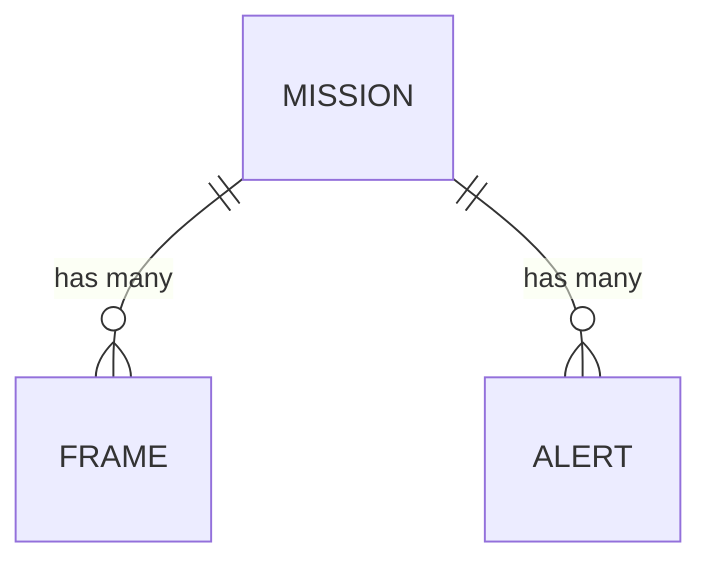

# Database

Data model design for FireRescue AI — what the prototype stores and why.

---

## Storage Philosophy

The prototype stores only what the MVP actually needs. The temptation in prototype development is to model the domain comprehensively and persist everything. This creates schema complexity, write overhead, and maintenance burden without delivering demonstrable value.

Two questions guide every persistence decision:

1. **Can this be derived from something already stored?** If yes, don't store it separately.
2. **Does the MVP require this after the process restarts?** If no, keep it in memory.

Applying these questions to the full domain produces three entities: `Mission`, `Frame`, and `Alert`. Everything else is either derivable, configuration, or in-memory state.

---

## Entities

### Mission

**What it represents:** A single activation of the system from start to end. The root container for all data collected during one run.

**Why it exists:** Every Frame and every Alert belongs to a specific mission. Without a mission record, there is no way to scope data or distinguish one run from another during a demonstration.

**Fields:**
- `id` — unique identifier
- `status` — ACTIVE or ENDED
- `started_at` — timestamp when the mission began
- `ended_at` — timestamp when the mission was stopped (null if still active)
- `scenario_name` — which simulation scenario was used

---

### Frame

**What it represents:** A single synchronized sensor snapshot from the drone at a specific position and time. This is the raw data record — exactly what the simulation (or future hardware) produced.

**Why it exists:** The Frame log is the ground truth of the mission. It is what the perception engine processes. It can be replayed after the mission to re-run analysis with a different model or different perception logic. It is also the audit trail that proves what conditions were present at what time.

The Frame stores the full `channels` payload as a JSON blob. This means new sensor modalities (thermal, LiDAR) are automatically stored without a schema change — the column holds whatever channels were present in the Frame.

**Fields:**
- `id` — unique identifier (matches `frame_id` from the Frame schema)
- `mission_id` — which mission this Frame belongs to
- `timestamp` — UTC datetime of capture
- `drone_id` — identifier of the drone that produced this Frame
- `pose_x`, `pose_y`, `pose_floor` — drone grid position
- `channels_json` — full channels payload serialized as JSON

**Relationships:** Belongs to one mission.

---

### Alert

**What it represents:** A specific notification generated by the perception engine when a threshold was crossed — either a hazard escalation or a probable victim detection.

**Why it exists:** Alerts are the primary output the operator acts on. Storing them separately from Frames makes the alert log directly queryable without replaying all perception logic. It also enables de-duplication: before generating an alert, the Mission Manager checks whether an identical alert for the same zone already exists in the current mission.

**Fields:**
- `id` — unique identifier (UUID)
- `mission_id` — which mission generated this alert
- `zone_id` — which zone triggered the alert
- `type` — HAZARD_ELEVATED or VICTIM_DETECTED
- `severity` — WARNING or CRITICAL
- `message` — human-readable description
- `triggered_at` — UTC timestamp

**Relationships:** Belongs to one mission.

---

## What Is Not Persisted and Why

**ZoneAnalysis** — Derived from Frames. The perception engine computes hazard levels and victim probabilities on every Frame. These results are merged into the in-memory `MissionState`. They do not need to be persisted separately because they can be re-derived by replaying the Frame log. Persisting them every tick adds write overhead and a redundant table with no MVP use case.

**Zone definitions** — Static configuration. The floor plan (zone IDs, labels, grid positions, types) does not change during a mission. It is loaded from a configuration file at startup and held in memory by the Mission Manager. Storing it in the database would add setup complexity (initial data load, migration concerns) without benefit.

**Drone records** — The drone's identity (`drone_id`) and position are already carried in every Frame. There is no state that belongs to the drone beyond what Frames already capture. A drone table would be a redundant index over data the Frame log already contains.

---

## Entity Relationship Overview

---

## Storage Notes

- All data is stored in a local SQLite file. No server process is required.
- The Frame log grows continuously during an active mission. A typical 10-minute demonstration at one Frame per second produces approximately 600 rows. The `channels_json` column for an MVP Frame with only an environmental channel is under 200 bytes per row. Total storage for a demo mission is well under 1 MB.
- No data is automatically deleted. Frames and Alerts are retained until the developer clears the database manually.
- The repository accesses the database via SQLAlchemy. Upgrading from SQLite to PostgreSQL requires changing one connection string. No application logic changes.
