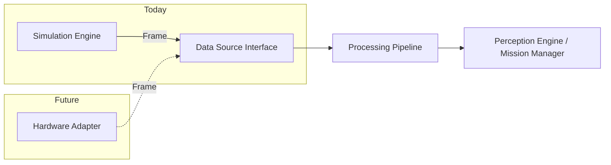

# Simulation

Design of the simulation layer for FireRescue AI — its purpose, structure, and the path from simulation to real hardware.

---

## Why Simulation Comes First

The fundamental constraint on this project is that no physical drone hardware exists. But the architectural goal is to build software that could eventually work with real hardware. These two facts together make simulation-first the only rational approach.

Simulation-first development has additional benefits beyond the hardware constraint:

**Reproducibility.** A simulation scenario runs identically every time. This makes it possible to verify that the pipeline, perception engine, and the rest of the system behave correctly without depending on physical conditions. Real environments are noisy, unpredictable, and impossible to reproduce exactly.

**Speed.** Development and testing are faster when the team is not waiting for hardware setup, battery charging, or physical access to a test building.

**Safety.** Bugs in the perception engine or alert logic do not cause real consequences during simulation. The software can be verified thoroughly before it ever touches hardware.

**Architectural discipline.** Designing the system so simulation can be replaced by hardware forces the team to define clear interfaces early. The `Frame` schema and `DataSource` protocol are the direct result of this discipline. A system built only for hardware would likely have hardware assumptions scattered throughout the codebase.

---

## How Simulation Fits Inside the Architecture

The simulation is a replaceable module. It occupies the data source position in the architecture and communicates with the backend exclusively by producing `Frame` objects through the DataSource Interface.



The backend does not know whether the source is simulation or hardware. It calls the interface, receives a `Frame`, and routes it through the pipeline. This is the core architectural invariant.

The simulation is structured as a self-contained module in `simulation/`. It has no dependencies on the backend beyond the `Frame` schema it must produce. It can be started, run, and tested independently.

---

## What the Simulation Produces

Each tick, the simulation produces one `Frame`. For the MVP, the Frame contains a `pose` and one channel: `environmental`.

```
Frame:
    frame_id:   <uuid>
    mission_id: <active mission id>
    timestamp:  <current UTC time>
    drone_id:   "sim-drone-alpha"
    pose:
        x:      <current grid x>
        y:      <current grid y>
        floor:  1
        heading: 0.0
    channels:
        "environmental":
            temperature:   <float, Celsius>
            co_level:      <float, ppm>
            smoke_density: <float, 0.0–1.0>
```

Future simulation modules (thermal camera emulation, synthetic LiDAR) would add channels to this Frame without changing the interface.

---

## Simulation Assumptions

The following simplifying assumptions are made for the MVP. They are acceptable for a prototype demonstration and do not affect the validity of the architecture.

**Building model:**
- The building is represented as a 2D grid of cells (zones)
- Each cell is approximately 3 m × 3 m
- A single floor is modeled (multi-floor is a future enhancement)
- The floor plan is static — walls and rooms do not change during a mission

**Drone behavior:**
- One virtual drone per mission
- The drone follows a pre-defined waypoint path through the building
- The drone moves at a fixed speed: one zone per tick
- The drone does not avoid obstacles (path is pre-validated against the floor plan)
- Drone position is always known exactly — no GPS noise in simulation

**Sensor values:**
- Temperature, CO level, and smoke density are the three simulated sensors (the `environmental` channel)
- Values in safe zones are sampled from a low-range normal distribution with small additive noise
- Values in hazard zones follow a configurable profile: temperature and CO ramp up as the fire spreads; smoke density follows a similar curve
- No sensor failure or packet loss is modeled in the MVP

**Hazard scenarios:**
- At least one preset scenario is available: fire starting in a specified zone and spreading to adjacent zones over time
- The scenario defines: fire origin zone, spread rate (zones per N ticks), and zones that become impassable when fully engulfed
- The scenario is deterministic — running it twice produces the same sequence of Frames

**Victim placement:**
- Victims are placed at fixed grid positions at the start of the scenario
- Victims do not move
- Zones containing a victim have elevated CO and temperature values to provide a signal for the perception engine

---

## Simulation Internal Structure

```
simulation/
├── environment.py    # Floor plan: rooms, zones, grid, adjacency map
├── drone.py          # Drone state: position, waypoint path, movement logic
├── sensors.py        # Environmental channel generation per zone and scenario state
├── scenarios.py      # Scenario definitions: initial conditions, spread rules, victim placement
└── runner.py         # Tick loop: advances state, assembles Frame, delivers via callback
```

The `runner.py` is the entry point. It:
1. Loads a scenario from `scenarios.py`
2. Initializes the environment and drone
3. Runs an async tick loop at the configured interval
4. Each tick:
   - Advances the scenario (fire spread, victim state)
   - Moves the drone one step along the waypoint path
   - Reads environmental sensor values from `sensors.py` for the current zone
   - Assembles a complete `Frame`
   - Calls `on_frame(frame)` — the callback registered by the Data Source Interface

---

## Transition Path to Real Hardware

Replacing the simulation with real hardware requires implementing one adapter that satisfies the DataSource protocol. No other code changes.

**Step 1 — Implement a hardware adapter.**
Create `backend/ingestion/hardware_adapter.py`. This adapter reads data from the real drone's communication channel (serial port, UDP socket, MQTT broker, or HTTP webhook from onboard software) and translates it into `Frame` objects.

**Step 2 — Populate the appropriate channels.**
If the hardware provides environmental sensors, populate `channels["environmental"]`. If it has a thermal camera, populate `channels["thermal"]`. The pipeline and perception engine handle whatever channels are present.

**Step 3 — Register the hardware adapter.**
In the backend configuration, replace `sim_adapter` with `hardware_adapter` as the active DataSource. This is a one-line change.

**Step 4 — Run the integration test suite.**
Existing integration tests verify that whatever DataSource is active produces valid Frames and that the pipeline processes them correctly. If the tests pass, the system operates identically to simulation.

**Step 5 — Handle hardware-specific concerns in the adapter only.**
Real hardware introduces packet loss, sensor noise, variable timing, and connection drops. All of these are handled inside the hardware adapter. The pipeline, perception engine, and Mission Manager are not aware of them.

The simulation remains available after hardware is introduced. Running both adapters in parallel (simulation and hardware) is a valid configuration for verification.

---

## What the Hardware Must Provide

For the system to function with real hardware, the hardware (or its onboard software) must produce Frames at a regular interval containing at minimum:

| Channel | Field | Type | Notes |
|---|---|---|---|
| pose | `x` | integer | Grid coordinate |
| pose | `y` | integer | Grid coordinate |
| pose | `floor` | integer | Floor number (1-indexed) |
| pose | `heading` | float | Degrees (can be 0.0 if unavailable) |
| environmental | `temperature` | float | Celsius |
| environmental | `co_level` | float | Parts per million |
| environmental | `smoke_density` | float | Normalized 0.0 – 1.0 |

If the hardware cannot supply a field directly, the adapter is responsible for estimating or deriving it. The pipeline always receives a complete, valid Frame.
