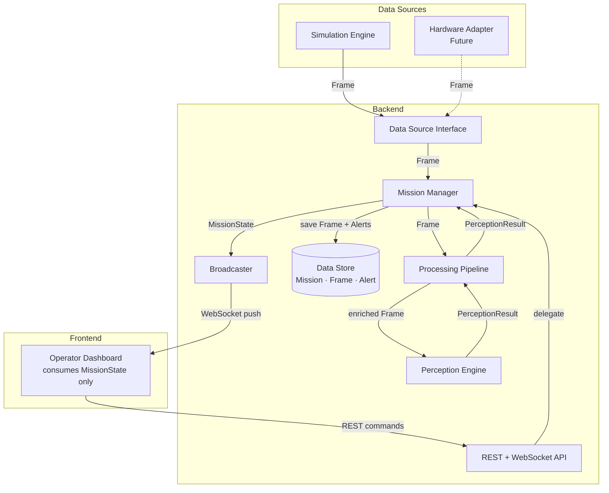

# System Overview

FireRescue AI — complete system description for the MVP prototype.

---

## Project Purpose

FireRescue AI is a research and engineering prototype that explores how AI-driven software can provide real-time situational awareness to firefighters and incident commanders during building rescue operations.

Firefighters entering a burning structure face zero-visibility conditions, rapidly spreading hazards, and the need to locate victims under extreme time pressure. Today, incident command has very limited visibility into what is happening inside the building. This prototype investigates whether a sensor-collecting, AI-processing software system can close that gap by producing a live, machine-interpreted view of interior conditions.

---

## Prototype Objective

Build a simulation-first software system that demonstrates the full data pipeline from sensor input to operator display, without requiring any physical hardware.

The prototype must:

1. Accept continuous sensor data from a data source (today: simulation, future: hardware)
2. Process incoming data through an explicit pipeline before perception
3. Apply perception logic to classify hazards and estimate victim locations
4. Manage mission state and present it as the single source of truth for the dashboard
5. Present a real-time operational dashboard driven solely by mission state
6. Remain completely independent from any specific hardware implementation

The prototype is intended for research demonstrations, engineering portfolios, and hackathon presentations. It is not designed for real operational deployment.

---

## Scope

The following capabilities are within scope for the MVP prototype:

- Virtual building environment (floor plan, rooms, zones)
- Virtual drone navigating the building
- Virtual sensors: temperature, smoke density, carbon monoxide, position
- Fire and hazard scenario emulation
- Processing pipeline with validation and pose-to-zone enrichment
- Perception Engine: hazard classification per zone, victim location estimation
- Mission lifecycle management (start, active, end)
- Real-time alert generation when sensor thresholds are exceeded
- Operator dashboard: floor map, drone position, sensor overlay, alert panel
- Persistent Frame log for post-mission replay

---

## Out of Scope

The following are explicitly not part of this prototype:

| Feature | Reason excluded |
|---|---|
| Real drone hardware or firmware | No hardware is available; hardware independence is a design goal |
| Additional sensor modalities (thermal, RGB, LiDAR) | Frame schema supports them; perception and simulation do not implement them in MVP |
| Multi-drone coordination | Out of scope for MVP |
| Voice or radio integration | Not relevant to the software architecture goals |
| User authentication and access control | Single-operator prototype |
| Cloud deployment or infrastructure | Local development only |
| Mobile interface | Desktop dashboard only for MVP |
| Real building floor plan import | Synthetic floor plan is sufficient for demonstration |
| Mission sharing or collaboration | Single-session, single-operator |
| Production reliability guarantees | Prototype, not production software |

---

## Overall System Workflow

A complete mission runs through the following stages:

```
1. OPERATOR STARTS MISSION
   The operator opens the dashboard and initiates a new mission.
   The backend creates a mission record, initializes MissionState,
   and activates the data source.

2. SIMULATION GENERATES A FRAME
   The simulation engine ticks at a configured interval.
   Each tick, the virtual drone moves to a new position.
   Virtual sensors produce values for the current zone.
   The simulation assembles a Frame — a synchronized snapshot with
   a pose and an environmental channel — and delivers it via the
   Data Source Interface callback.

3. PIPELINE PROCESSES THE FRAME
   The pipeline receives the Frame.
   Stage 1 (Validator): checks the Frame is well-formed and belongs
     to the active mission.
   Stage 2 (Enricher): resolves the drone's grid coordinates to a
     zone_id using the in-memory floor plan.
   The enriched Frame is passed to the Perception Engine.

4. PERCEPTION ENGINE ANALYZES THE FRAME
   The engine receives the enriched Frame and current zone history.
   It classifies the hazard level for the current zone.
   It updates the victim presence probability estimate.
   It evaluates alert thresholds and returns any new alerts.
   It returns a PerceptionResult to the pipeline.

5. MISSION MANAGER UPDATES STATE
   The Mission Manager receives the PerceptionResult from the pipeline.
   It persists the raw Frame to the data store.
   It persists any new Alert records.
   It merges the PerceptionResult into the in-memory MissionState,
   updating zone states, active alerts, and latest readings.

6. BROADCASTER PUSHES STATE
   The Mission Manager hands the updated MissionState to the broadcaster.
   The broadcaster serializes it to JSON and pushes it to all connected
   WebSocket clients.

7. FRONTEND RENDERS UPDATE
   The dashboard receives the MissionState snapshot.
   The floor map re-renders: drone position, zone hazard colors.
   The alert panel updates.
   The sensor panel shows the latest environmental readings.
   The status bar shows mission time.

8. OPERATOR ENDS MISSION
   The operator stops the mission via the dashboard.
   The backend marks the mission as ended and deactivates the data source.
   The stored Frame log is available for post-mission replay.
```

---

## Major Software Components

| Component | Location | Responsibility |
|---|---|---|
| **Simulation Engine** | `simulation/` | Generates synthetic Frames. Replaceable by hardware. |
| **Data Source Interface** | `backend/ingestion/` | Defines the Frame contract between any data source and the backend. |
| **Processing Pipeline** | `backend/pipeline/` | Validates and enriches each Frame before perception. |
| **Perception Engine** | `perception/` | Hazard classification, victim estimation, alert generation. |
| **Mission Manager** | `backend/mission/` | Owns MissionState; coordinates pipeline, persistence, and broadcasting. |
| **Data Store** | `backend/store/` | Persists Mission, Frame, and Alert records. |
| **Broadcaster** | `backend/broadcaster.py` | Pushes MissionState to all WebSocket clients. |
| **Backend API** | `backend/api/` | REST and WebSocket entry points for the frontend. |
| **Frontend Dashboard** | `frontend/` | Operator-facing real-time display; consumes MissionState only. |

---

## High-Level Architecture Diagram



The dashed line from `Hardware Adapter` indicates a future connection. Everything else is part of the MVP.

---

## Data Flow Summary

```
Simulation Engine
    │
    │  Frame { pose, channels: { environmental: { temp, CO, smoke } } }
    ▼
Data Source Interface
    │
    │  Frame
    ▼
Mission Manager
    │
    │  Frame
    ▼
Processing Pipeline
    ├─ Validator:  checks schema and mission context
    ├─ Enricher:   resolves pose → zone_id
    │
    │  enriched Frame
    ▼
Perception Engine
    │
    │  PerceptionResult { zone_id, hazard_level, victim_probability, alerts[] }
    ▼
Mission Manager ──────────────────────────► Data Store
    │                                        (Frame + Alert records)
    │  updates in-memory MissionState
    │
    │  MissionState
    ▼
Broadcaster
    │
    │  WebSocket JSON push
    ▼
Frontend Dashboard
    (renders floor map, alerts, sensor panel — all from MissionState)
```

The Mission Manager is the single source of truth for live mission state. The dashboard has no knowledge of Frames, PerceptionResults, or zone analysis logic. It only knows `MissionState`.
